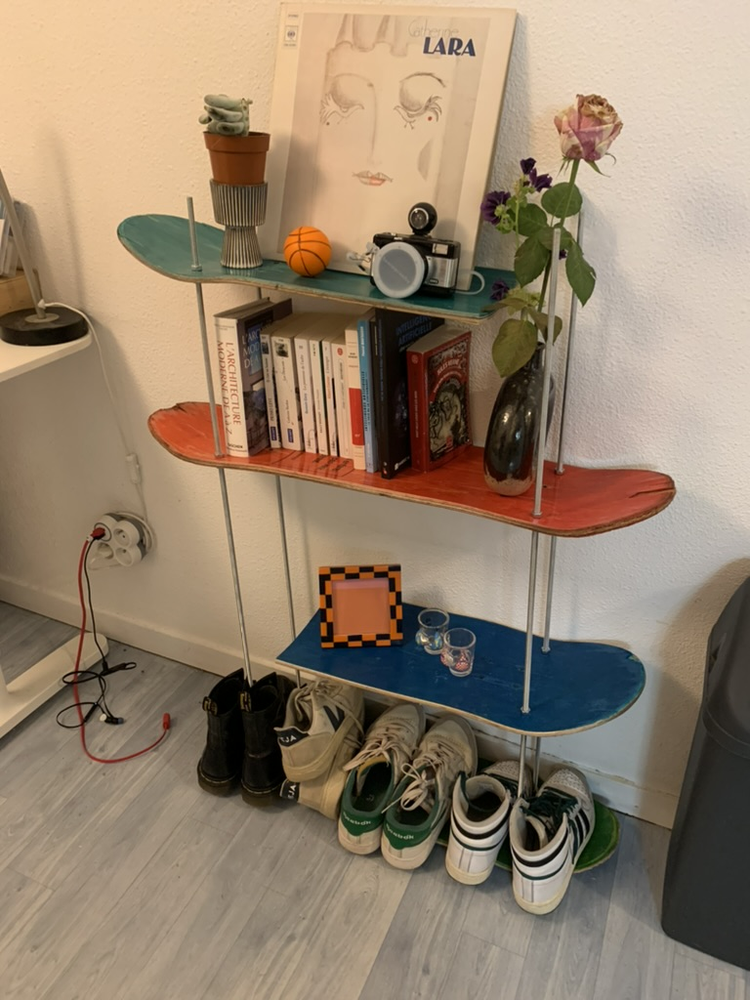
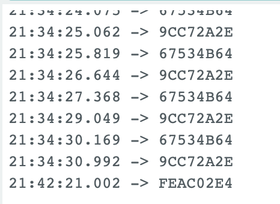
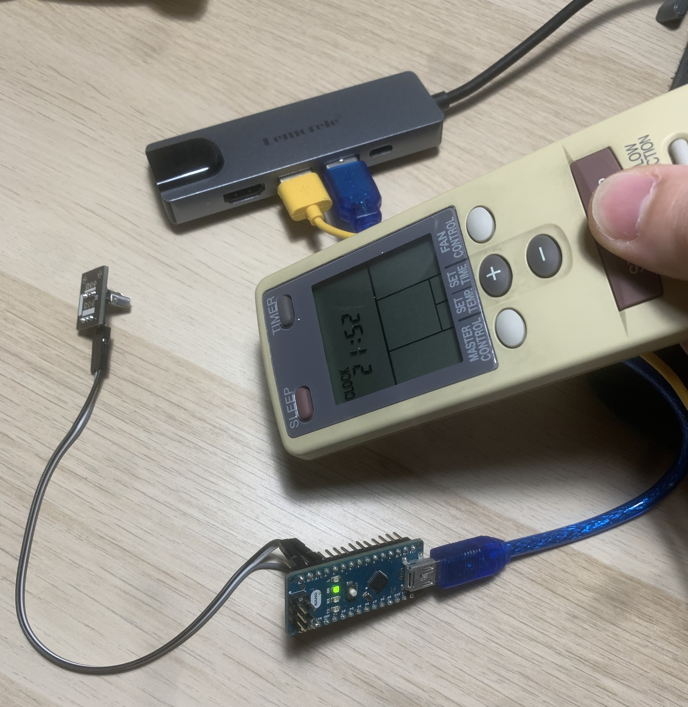

# 🚀 Projets du Dimanche


## 👨‍🚀 Auteur
- [Côme Cervantes](https://www.linkedin.com/in/côme-cervantes)

## À propos de ce projet

Bienvenue sur mon espace dédié à l'ingénierie créative ! Je suis passionné par l'électronique, la mécanique et tout ce qui touche au vaste domaine de l'ingénierie. Sur cette page Git, je partage mes petites aventures hebdomadaires à travers des projets divers et variés, tous liés à l'univers de la conception et de la réalisation.

## Ce que vous trouverez ici

🔍 **Exploration hebdomadaire :** Chaque semaine, je me lance dans un nouveau projet, explorant les frontières de l'électronique, de la mécanique et d'autres domaines connexes. Vous pourrez suivre l'évolution de mes idées, de la conception à la réalisation.

🛠️ **Conception collaborative :** L'ingénierie est une discipline collaborative. J'encourage la participation, les commentaires et les idées. N'hésitez pas à partager vos réflexions, suggestions ou même à contribuer directement aux projets en cours.

📚 **Apprentissage continu :** Chaque projet est une occasion d'apprendre quelque chose de nouveau. Vous trouverez des ressources, des tutoriels et des retours d'expérience qui pourront vous être utiles dans vos propres projets.

## 📖 Table des matières
- [Projet 1 - Tourelle contrôlée par un accéléromètre](#projet-1---tourelle-contrôlée-par-un-accéléromètre)
- [Projet 2 - Etagère en skates](#projet-2---etagère-en-skates)

## 🤝 Contributions
Les contributions sont les bienvenues! Si vous souhaitez améliorer ce projet, n'hésitez pas à créer une pull request.
Si vous avez des questions ou des remarques c'est avec plaisir que je vous répondrai.

# Projet 1 - Tourelle contrôlée par un accéléromètre
Ce projet consiste en une tourelle contrôlée par deux servomoteurs en fonction de la position de la main détectée par un accéléromètre MPU6050. La tourelle s'ajuste verticalement et horizontalement pour pointer vers la direction de la main.

Le but ici était de se familiariser avec l'utilisation de l'accéléromètre et de l'intégrer dans un projet, pour rendre cela plus visuel j'ai décidé de faire une tourelle avec deux servomoteurs.

### Matériel nécessaire
- Arduino (compatible avec le code)
- Accéléromètre MPU6050
- Deux servomoteurs
- Fils de connexion
- Breadboard

### Dépendances
- [Adafruit MPU6050 Library](https://github.com/adafruit/Adafruit_MPU6050)
- [Adafruit Sensor Library](https://github.com/adafruit/Adafruit_Sensor)

### Configuration matérielle
1. Connectez l'accéléromètre MPU6050 aux broches appropriées sur votre Arduino.
2. Connectez les servomoteurs aux broches appropriées sur votre Arduino.
3. Assurez-vous que toutes les dépendances sont installées.


   **Broches :**

   
    servobas = D3
    servohaut = D9
    MPU6050 SDA = A4
    MPU6050 SCL = A5


### Utilisation
1. Alimentez votre Arduino.
2. La tourelle s'ajustera automatiquement en fonction de la position de votre main détectée par l'accéléromètre.

Rappelons que le MPU6050 est orienté de cette manière ; il faudra donc incliner le poignet vers l'avant pour monter le bras et de gauche à droite pour tourner.


On peut facilement imaginer de faire un gant sur lequel on fixerait l'accéléromètre pour avoir une meilleure précision.

Ici en fonction de la rotation en X et en Y du capteur nos deux servomoteurs vont s'ajuster pour pointer vers la direction de la main. Dans une version future, il serait bien que l'axe Z soit utilisé pour rendre le mouvement plus simple.

À noter que lors du développement du capteur, j'ai remarqué dans la datasheet du MPU6050 que le composant possède un thermomètre intégré dont je questionne l'utilité. 
On pourrait utiliser cela pour par exemple détecter lorsque la commande n'est pas dans la main et mettre le système en veille pour économiser de l'énergie.

---

# Projet 2 - Etagère en skates

À la recherche d'un nouveau meuble ? Cette semaine, découvrez une étagère conçue à partir de planches de skate recyclées. Alliant économie, ergonomie, design, et respect de l'environnement, cette étagère se présente comme l'option parfaite pour votre espace.

Je vous guide aujourd'hui à travers la création de ce meuble unique. L'objectif ici est de vous familiariser avec l'utilisation d'outils d'atelier tels que perceuses et ponceuses. N'hésitez donc pas à vous rendre rapidement dans le fablab le plus proche pour donner vie à votre création.

## Matériel nécessaire
- 4 planches de skate
- 4 barres de fer avec pas de vis
- 24 écrous

## Outils nécessaires
- Perceuse
- Ponceuse
- Scie 
- Mètre
- Crayon

Commencer par nettoyer vos planches récupéré dans le skatepark du coin. Ensuite, il faut les poncer pour enlever les éventuels défauts et les rendre plus lisses.

Vous optiendrez ensuite assez simplement après quelques trous et un peu de bricolage une étagère originale et unique.



---

# Projet 3 - Detection d'un champ magnétique avec un capteur Hall

Ce projet consiste en la détection d'un champ magnétique avec un capteur Hall. L'objectif est de pouvoir détecter la présence d'un aimant à proximité du capteur.

## Matériel nécessaire
- Arduino (compatible avec le code)
- Capteur Hall
- Aimant
- led
- registre à décalage 74HC595

## Dépendances
- Aucune

Notre capteur à effet hall est un capteur qui réagit à un champ magnétique. Il est donc possible de détecter la présence d'un aimant à proximité du capteur.
Nous allons avec la valeur que nous récupérons allumer une série de LED en fonction de cette valeur 


---

# Projet 4 - Detecteur d'intensité sonore

Ce projet consiste en la détection d'une intensité sonore avec un microphone. L'objectif est de pouvoir détecter le niveau sonore ambiant.

## Matériel nécessaire
- Arduino (compatible avec le code)
- Microphone
- led
- registre à décalage 74HC595

De la même manière que le projet dernier le but est de récupérer une valeur de l'intensité sonore et d'allumer une série de LED en fonction de cette valeur.
Dans le code cependant cette inténsité en dBa nécessite une série de calcule pour être convertie en une valeur exploitable. Je viendrais par la suite sur le détail de ce fonctionnement. 

---

# Projet ? - Allumage chauffage à distance avec LED IR et ESP

Ce projet consiste en un système d'allumage à distance pour un chauffage à gaz. L'objectif est de pouvoir allumer le chauffage à distance, avant d'arriver chez soi, pour que la maison soit chaude à l'arrivée.

## Matériel nécessaire
- Esp (compatible avec le code)
- LED IR
- Fils de connexion
- Breadboard

## Dépendances
- IRremoteESP8266
- ESP8266WiFi

## Configuration matérielle
1. Connectez la LED IR aux broches appropriées sur votre ESP.
2. Assurez-vous que toutes les dépendances sont installées.
3. Connectez votre ESP à votre réseau WiFi.

   **Broches :**

   
    LED IR = D2

## Installation du code
1. Clonez ce [dépôt](Allumage-chauffage) sur votre ordinateur.
2. Ouvrez le fichier Arduino (.ino) dans l'IDE Arduino.
3. Téléversez le code sur votre carte ESP.
4. Modifiez le code avec votre SSID et votre mot de passe WiFi.
5. Modifiez le code avec l'adresse IP de votre ESP.
7. Modifiez le code avec le code de votre télécommande.

Pour commencer mon projet j'ai utilisé une LED IR et un ESP8266. J'ai ensuite récupéré le code de ma télécommande pour pouvoir l'envoyer à distance.
Ainsi avec un petit montage et un peu de code je récupère le code de ma télécommande.

Le code pour récuperer le code est le suivant :

``` c++
#include <IRremote.h> 

#define PIN_RECEPTION 3

IRrecv receiver(PIN_RECEPTION); 
decode_results results; 

void setup() {
   Serial.begin(9600); 
   receiver.enableIRIn(); 
   receiver.blink13(true); 
}
void loop() {
  if (receiver.decode(&results)) { 
    Serial.println(results.value, HEX); 
    receiver.resume(); 
  }
}
```

Ainsi je récupère ces valeurs : 



Voici l'image du montage :



Puis j'ai fais un code pour cette fois-ci ne pas récupérer le code, mais l'envoyer :

Le code ON de ma télécommande -> 67534B64 en HEX -> 1733512036
Le code OFF de ma télécommande -> 9CC72A2E en HEX -> 2630298158

``` c++
