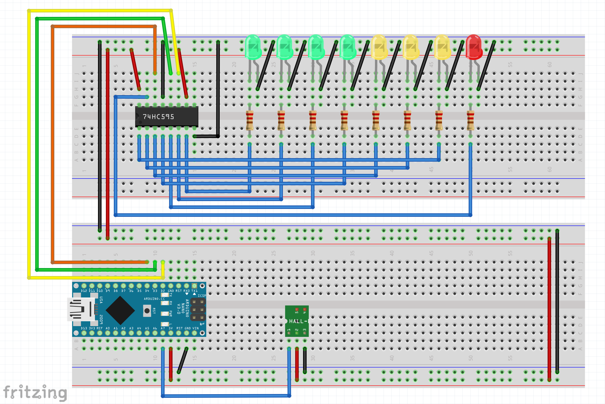
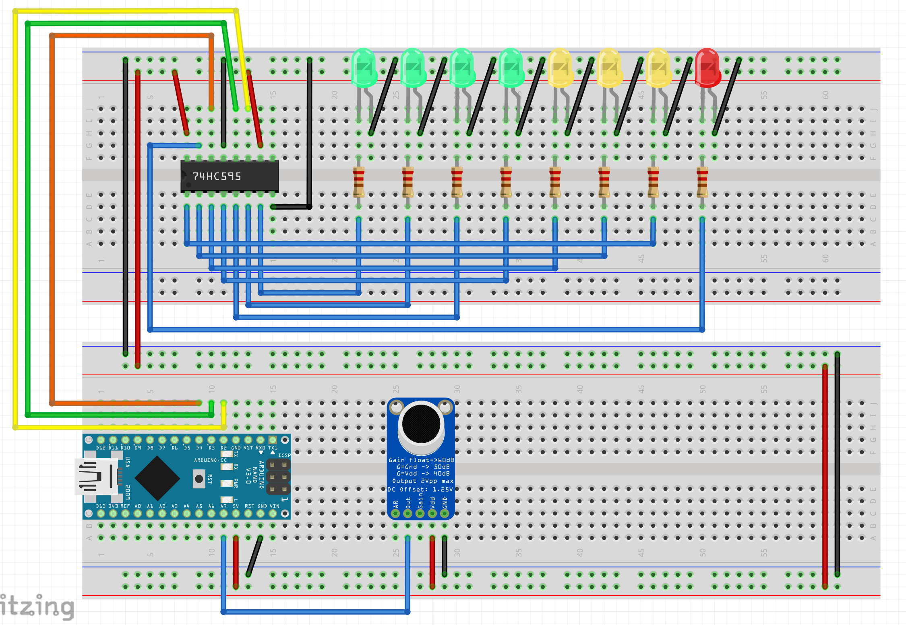

# 🚀 Projets du Dimanche

## 👨‍🚀 Auteur

- [Côme Cervantes](https://www.linkedin.com/in/côme-cervantes)

## À propos de ce projet

Bienvenue sur mon espace dédié à l'ingénierie créative ! Je suis passionné par l'électronique, la mécanique et tout ce
qui touche au vaste domaine de l'ingénierie. Sur ce dépôt GitHub, je partage mes petites aventures hebdomadaires à
travers des projets divers et variés, tous liés à l'univers de la conception et de la réalisation.

## Ce que vous trouverez ici

🔍 **Exploration hebdomadaire :** Chaque semaine, je me lance dans un nouveau projet, explorant les limites de
l'électronique, de la mécanique et d'autres domaines connexes. Vous pourrez suivre l'évolution de mes idées, de la
conception à la réalisation.

🛠️ **Conception collaborative :** L'ingénierie est une discipline collaborative. J'encourage la participation, les
commentaires et les idées. N'hésitez pas à partager vos réflexions, suggestions ou même à contribuer directement aux
projets en cours.

📚 **Apprentissage continu :** Chaque projet est une occasion d'apprendre quelque chose de nouveau. Vous trouverez des
ressources, des tutoriels et des retours d'expérience qui pourront vous être utiles dans vos propres projets.

## 📖 Table des matières

- [Projets du Dimanche](#-projets-du-dimanche)
    - [Auteur](#-auteur)
    - [À propos de ce projet](#à-propos-de-ce-projet)
    - [Ce que vous trouverez ici](#ce-que-vous-trouverez-ici)
    - [Table des matières](#-table-des-matières)

- [Petits Projets](#petits-projets)
    - [Projet 1 - Tourelle contrôlée par un accéléromètre](#projet-1---tourelle-contrôlée-par-un-accéléromètre)
    - [Projet 2 - Etagère en skates](#projet-2---etagère-en-skates)
    - [Projet 3 - Detection d'un champ magnétique avec un capteur Hall](#projet-3---detection-dun-champ-magnétique-avec-un-capteur-hall)
    - [Projet 4 - Detecteur d'intensité sonore](#projet-4---detecteur-dintensité-sonore)
    - [Projet ? - Allumage chauffage à distance avec LED IR et ESP](#projet---allumage-chauffage-à-distance-avec-led-ir-et-esp)
- [Gros projets](#gros-projets)
    - [Gros projets 1 - Drone avec châssis imprimé en 3D](#gros-projets-1---drone-avec-châssis-imprimé-en-3d)
    - [Gros projets 2 - Création d'une maille textile imprimé en 3D](#gros-projets-2---création-dune-maille-textile-imprimé-en-3d)

## 🤝 Contributions

Les contributions sont les bienvenues! Si vous souhaitez améliorer ce projet, n'hésitez pas à créer une pull request.
Si vous avez des questions ou des remarques c'est avec plaisir que je vous répondrai.

---

# Petits Projets

---

# Projet 1 - Tourelle contrôlée par un accéléromètre

Ce projet consiste en une tourelle contrôlée par deux servomoteurs en fonction de la position de la main détectée par un
accéléromètre MPU6050. La tourelle s'ajuste verticalement et horizontalement pour pointer vers la direction de la main.

Le but ici était de se familiariser avec l'utilisation de l'accéléromètre et de l'intégrer dans un projet, pour rendre
cela plus visuel j'ai décidé de faire une tourelle avec deux servomoteurs.

Rappelons que le MPU6050 est orienté de cette manière ; il faudra donc incliner le poignet vers l'avant pour monter le
bras et de gauche à droite pour tourner.


On peut facilement imaginer de faire un gant sur lequel on fixerait l'accéléromètre pour avoir une meilleure précision.

Ici en fonction de la rotation en X et en Y du capteur nos deux servomoteurs vont s'ajuster pour pointer vers la
direction de la main. Dans une version future, il serait bien que l'axe Z soit utilisé pour rendre le mouvement plus
simple.

À noter que lors du développement du capteur, j'ai remarqué dans la datasheet du MPU6050 que le composant possède un
thermomètre intégré dont je questionne l'utilité.
On pourrait utiliser cela pour par exemple détecter lorsque la commande n'est pas dans la main et mettre le système en
veille pour économiser de l'énergie.

---

# Projet 2 - Etagère en skates

À la recherche d'un nouveau meuble ? Cette semaine, découvrez une étagère conçue à partir de planches de skate
recyclées. Alliant économie, ergonomie, design, et respect de l'environnement, cette étagère se présente comme l'option
parfaite pour votre espace.

Je vous guide aujourd'hui à travers la création de ce meuble unique. L'objectif ici est de vous familiariser avec l'
utilisation d'outils d'atelier tels que perceuses et ponceuses. N'hésitez donc pas à vous rendre rapidement dans le
fablab le plus proche pour donner vie à votre création.

Commencer par nettoyer vos planches récupéré dans le skatepark du coin. Ensuite, il faut les poncer pour enlever les
éventuels défauts et les rendre plus lisses.

Vous obtiendrez ensuite assez simplement après quelques trous et un peu de bricolage une étagère originale et unique.


---

# Projet 3 - Detection d'un champ magnétique avec un capteur Hall

Ce projet consiste en la détection d'un champ magnétique avec un capteur Hall. L'objectif est de pouvoir détecter la
présence d'un aimant à proximité du capteur.

Notre capteur à effet hall est un capteur qui réagit à un champ magnétique. Il est donc possible de détecter la présence
d'un aimant à proximité du capteur.
Nous allons avec la valeur que nous récupérons allumer une série de LED en fonction de cette valeur

Ici en se référant à la datasheet du capteur on voit que le premier seuil d'activation se trouve à 10 gausse ainsi avec
une simple fonction map on pourrait estimer le champ précisément.
De plus on pourrait imaginer un système de détection de la direction du champ magnétique pour par exemple détecter la
présence d'un aimant à proximité, avec plusieurs capteurs. J'ai réussi à récupérer une valeur maintenant je peux la
traiter comme je le veux je voulais dans ce projet juste imager ce champ mais j'utiliserais surement ce capteur dans un
futur projet.



Je vais ensuite rajouter une fonction pour transcrire cette valeur en une valeur d'intensité et de champ
electromagnétique.

---

# Projet 4 - Detecteur d'intensité sonore

Ce projet consiste en la détection d'une intensité sonore avec un microphone. L'objectif est de pouvoir détecter le
niveau sonore ambiant.

De la même manière que le projet dernier le but est de récupérer une valeur de l'intensité sonore et d'allumer une série
de LED en fonction de cette valeur.
Dans le code cependant cette inténsité en dBa nécessite une série de calcule pour être convertie en une valeur
exploitable. Je viendrais par la suite sur le détail de ce fonctionnement.



---

# Projet ? - Allumage chauffage à distance avec LED IR et ESP

Ce projet consiste en un système d'allumage à distance pour un chauffage à gaz. L'objectif est de pouvoir allumer le
chauffage à distance, avant d'arriver chez soi, pour que la maison soit chaude à l'arrivée.

Pour commencer mon projet j'ai utilisé une LED IR et un ESP8266. J'ai ensuite récupéré le code de ma télécommande pour
pouvoir l'envoyer à distance.
Ainsi avec un petit montage et un peu de code je récupère le code de ma télécommande.

Le code pour récuperer le code est le suivant :

``` c++
#include <IRremote.h> 

#define PIN_RECEPTION 3

IRrecv receiver(PIN_RECEPTION); 
decode_results results; 

void setup() {
   Serial.begin(9600); 
   receiver.enableIRIn(); 
   receiver.blink13(true); 
}
void loop() {
  if (receiver.decode(&results)) { 
    Serial.println(results.value, HEX); 
    receiver.resume(); 
  }
}
```

Ainsi je récupère ces valeurs :


Voici l'image du montage :


Puis j'ai fais un code pour cette fois-ci ne pas récupérer le code, mais l'envoyer :

Le code ON de ma télécommande -> 67534B64 en HEX -> 1733512036
Le code OFF de ma télécommande -> 9CC72A2E en HEX -> 2630298158


---

# Gros projets 1 - Drone avec châssis imprimé en 3D


L'objectif ici est de concevoir un drone FPV à partir d'un châssis et d'une pile 18650, un projet initialement conçu par
Dave\_C\_FPV il y a quelques années. Notre but est de le moderniser tout en conservant le même concept de base. Avec les
composants d'aujourd'hui nous espérons améliorer les capacités du drone pour avoir un drone peu cher et simple à
construire.

## Étapes

### Étape 1 : L'impression du châssis

Premièrement j'ai imprimé le châssis disponible sur thingiverse de Dave\_C\_FPV et l'ai imprimé avec la _Prusa Mini_
comme tel, cela me permettra d'assembler la première version du drone.

Cependant il est clair que ce châssis sera amené à changer car trop peu adapter à mon utilisation.&nbsp.

### Étape 2 : Achat / Choix des composants

Cette étape est cruciale je vais devoir choisir les différents composants pour le drone, je vais essayer de faire au
moins cher et au plus efficace, en effet le but de ce projet est avant tout de rendre **très** accessible le fpv.

## Fichiers CAD


---

# Gros projets 2 - Création d'une maille textile imprimé en 3D


Dans ce projet, je voulais créer un textile imprimé en 3D. Pour cela, je suis partie d'une base sur Thingiverse d'une
maille. La limite de cette maille est sa résistance. Pour résoudre ce problème nous avons rajouté un mesh en tissu pour
consolider cette structure. Ainsi nous avons pu faire un sac et dans le future nous réfléchissons à faire des habits en
retravaillant le concept.

## Étapes

### Étape 1 : Les tests

Pour commencer, nous avons dû tester différentes possibilités et réglages d'impression sur de petites surfaces. Nous
avons ainsi testé en miniature la fusion du maillage textile sur la maille. Ce processus fonctionne très bien avec un
fer à repasser et permet d'ajouter de la solidité aux maillons, évitant ainsi de les scinder à vide.


### Étape 2 : Impression en grand

Maintenant que la technique fonctionne, j'ai imprimé le fichier "maille.stl" à l'échelle 97.47. Pour la suite du projet,
nous avions besoin d'au moins 3 panneaux. À noter qu'après les tests, les imprimantes les plus performantes pour cette
maille sont la Prusa (Mini et MK4) ainsi que la Bambou, bien entendu.


## Fichiers CAD


